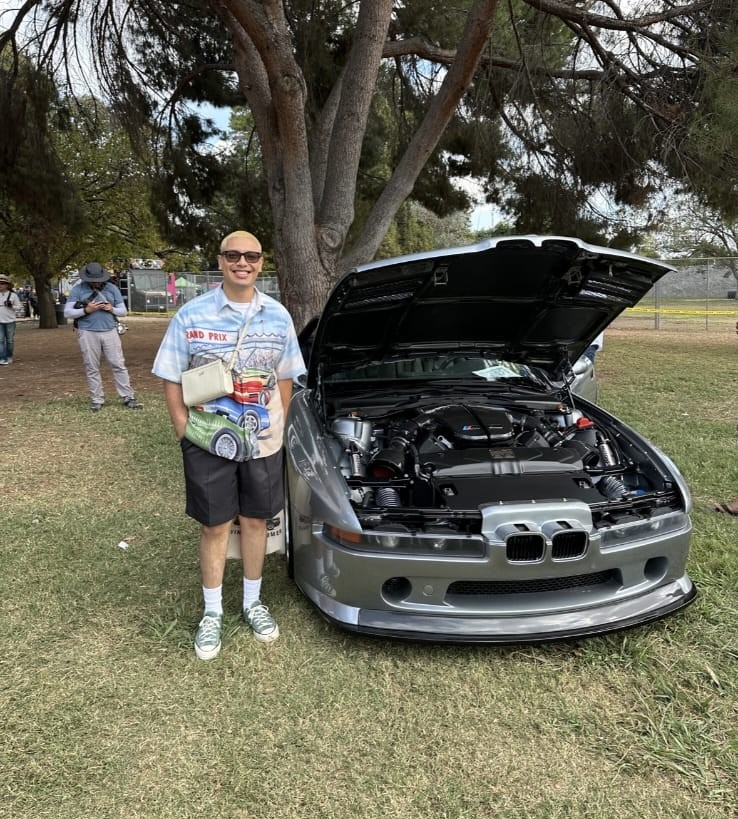

::: {.portfolio-home}
::: {.intro}
::: {.intro__photo}
{fig-alt="Portrait of Arturo Rosas"}
:::

::: {.intro__copy}
# Arturo Rosas

**Customer service professional. Sales advisor. Project coordinator.**

I help customers make confident decisions by listening closely, identifying needs, and delivering tailored solutions. My experience spans **appliance sales, client communication, product education, team training, project coordination, and business/marketing coursework**.

I am currently building a portfolio that connects my professional experience at Best Buy with my academic work in **International Business & Marketing**, including space for **Google Analytics, marketing projects, and coursework-based case studies**.

[View Resume](resume.qmd){.btn .btn-primary}
[Work With Me](services.qmd){.btn .btn-outline-secondary}
:::
:::

---

## What I Do

::: {.two-column}
::: {.column-block}
### For Customers & Clients

- **Needs assessment** - understanding customer goals, constraints, priorities, budgets, and decision criteria before recommending a solution
- **Tailored recommendations** - matching clients with high-value appliance products and explaining the practical benefits behind each option
- **Clear communication** - translating product details, project expectations, timelines, and next steps into language customers can trust
- **Issue resolution** - handling complex concerns with patience, professionalism, and a focus on customer satisfaction

[View Services ->](services.qmd){.text-link}
:::

::: {.column-block}
### For Teams & Projects

- **Project coordination** across customers, contractors, and internal teams to keep expectations aligned
- **Product knowledge** that supports stronger sales conversations and more confident customer decisions
- **Training and mentoring** that helps team members improve product understanding and service quality
- **CRM, Microsoft Office, and documentation habits** that keep customer information and follow-up organized

[View Experience ->](resume.qmd){.text-link}
:::
:::

---

## About

I'm a **results-driven professional** with experience in customer service, sales, and project coordination. I have a strong track record of assessing client needs, delivering tailored solutions, and working with cross-functional teams to support successful outcomes.

At Best Buy, I serve as an Appliance Category Advisor, where I help customers evaluate products, coordinate expectations with contractors and clients, resolve complex concerns, and train team members. I am bilingual in Spanish and bring strong communication, problem-solving, and relationship-building skills to customer-facing work.

I am currently pursuing a **Bachelor of Science in International Business & Marketing** at California State Polytechnic University, Pomona, with expected graduation in 2027. This portfolio will continue to grow with coursework, Google Analytics exercises, marketing projects, and applied business work.

---

## Selected Work

::: {.work-grid}
::: {.work-item}
### Appliance Sales Advising

Delivered tailored appliance recommendations by assessing customer needs, explaining product value, comparing alternatives, and supporting confident purchase decisions in a high-consideration retail environment.

[View experience ->](listings/appliance-sales-advising.qmd){.text-link}
:::

::: {.work-item}
### Client & Contractor Coordination

Collaborated with contractors and clients to keep project plans aligned with expectations, timelines, installation needs, and customer priorities.

[View coordination ->](listings/client-contractor-coordination.qmd){.text-link}
:::

::: {.work-item}
### Team Training

Trained and mentored team members by sharing product knowledge, sales practices, customer-service approaches, and practical ways to improve team effectiveness.

[View skills ->](listings/team-training.qmd){.text-link}
:::
:::

---

## Recognition

- **Current role** - Appliance Category Advisor at Best Buy in West Covina, CA
- **Education** - B.S. in International Business & Marketing, expected 2027
- **Bilingual communication** - Fluent in Spanish and experienced in customer-facing support
- **Portfolio growth areas** - Coursework, Google Analytics, marketing projects, and applied business work

---

## Let's Connect

Whether you're looking for a customer service professional, sales advisor, or project coordination candidate, I'd be glad to connect.

[arturorosas9@gmail.com](mailto:arturorosas9@gmail.com) | [(909) 635-9143](tel:+19096359143) | [LinkedIn](https://linkedin.com/in/auro-ros-003a7286)
:::
