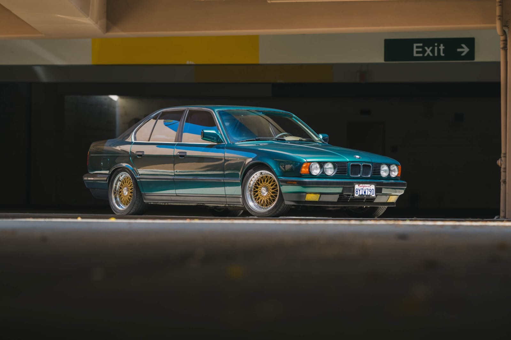
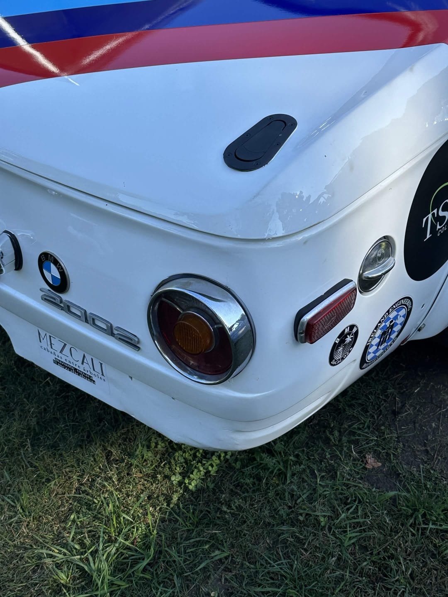
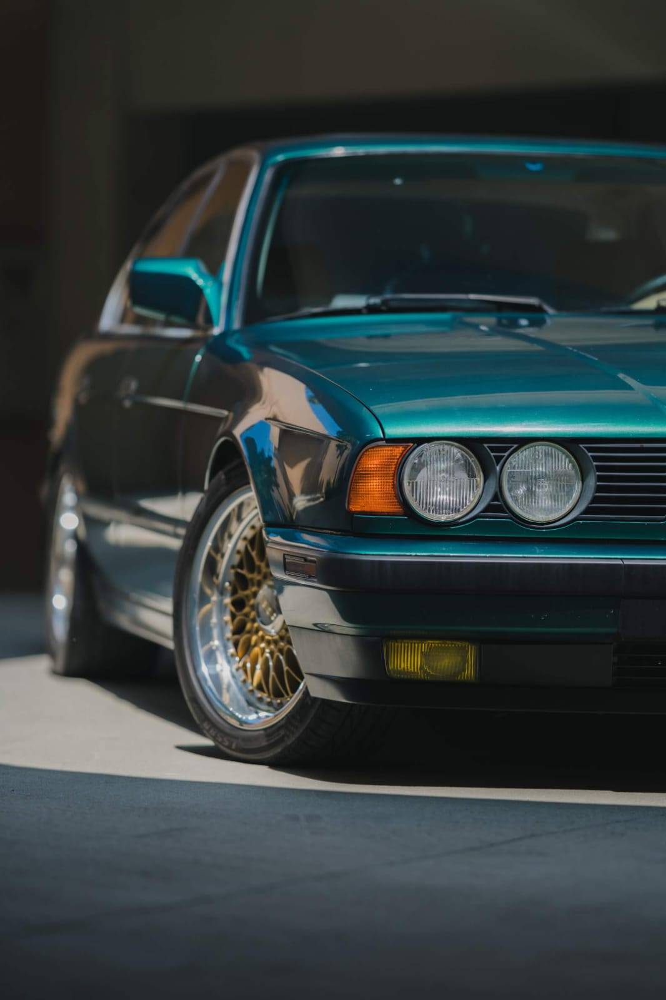
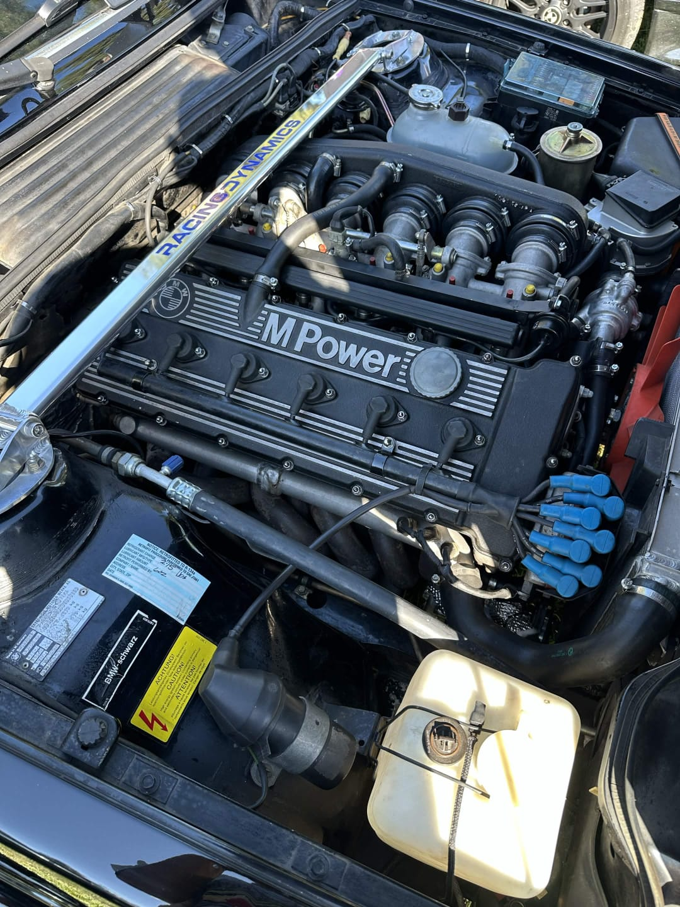
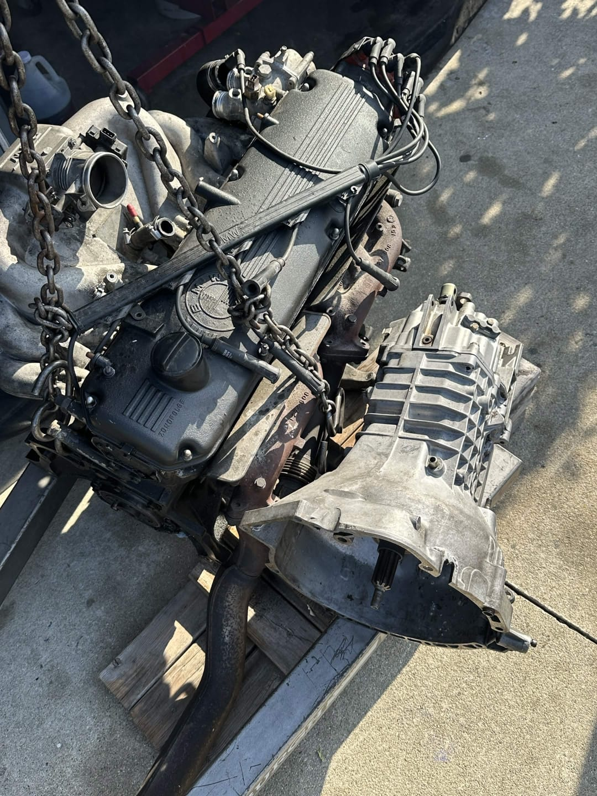

## Marketing Projects

This section will hold Arturo's applied marketing projects, including class assignments, independent work, campaign ideas, customer research, and business case studies.

The goal is to show how Arturo thinks through marketing problems: identifying the audience, understanding the customer need, defining a message, recommending channels, and connecting the work to measurable outcomes.

## Featured Projects

This section highlights Arturo's diverse portfolio, showcasing his professional marketing photography and technical engineering builds.

::: {.content-grid}
::: {.content-card}
### Professional Photography

```{=html}
<div id="photographyCarousel" class="carousel slide" data-bs-ride="carousel">
  <div class="carousel-inner">
    <div class="carousel-item active">
      
    </div>
    <div class="carousel-item">
      
    </div>
    <div class="carousel-item">
      
    </div>
  </div>
  <button class="carousel-control-prev" type="button" data-bs-target="#photographyCarousel" data-bs-slide="prev">
    <span class="carousel-control-prev-icon" aria-hidden="true"></span>
    <span class="visually-hidden">Previous</span>
  </button>
  <button class="carousel-control-next" type="button" data-bs-target="#photographyCarousel" data-bs-slide="next">
    <span class="carousel-control-next-icon" aria-hidden="true"></span>
    <span class="visually-hidden">Next</span>
  </button>
</div>
```

Arturo specializes in high-quality automotive photography, capturing the essence of design and performance. His work focuses on professional lighting, composition, and post-processing to create compelling visual narratives for marketing campaigns.
:::

::: {.content-card}
### Technical Engineering Builds

```{=html}
<div id="buildsCarousel" class="carousel slide" data-bs-ride="carousel">
  <div class="carousel-inner">
    <div class="carousel-item active">
      
    </div>
    <div class="carousel-item">
      
    </div>
  </div>
  <button class="carousel-control-prev" type="button" data-bs-target="#buildsCarousel" data-bs-slide="prev">
    <span class="carousel-control-prev-icon" aria-hidden="true"></span>
    <span class="visually-hidden">Previous</span>
  </button>
  <button class="carousel-control-next" type="button" data-bs-target="#buildsCarousel" data-bs-slide="next">
    <span class="carousel-control-next-icon" aria-hidden="true"></span>
    <span class="visually-hidden">Next</span>
  </button>
</div>
```

Beyond photography, Arturo is deeply involved in technical engineering projects. This section showcases his work on high-performance engine builds and mechanical assemblies, demonstrating his attention to detail, technical proficiency, and passion for engineering excellence.
:::
:::
